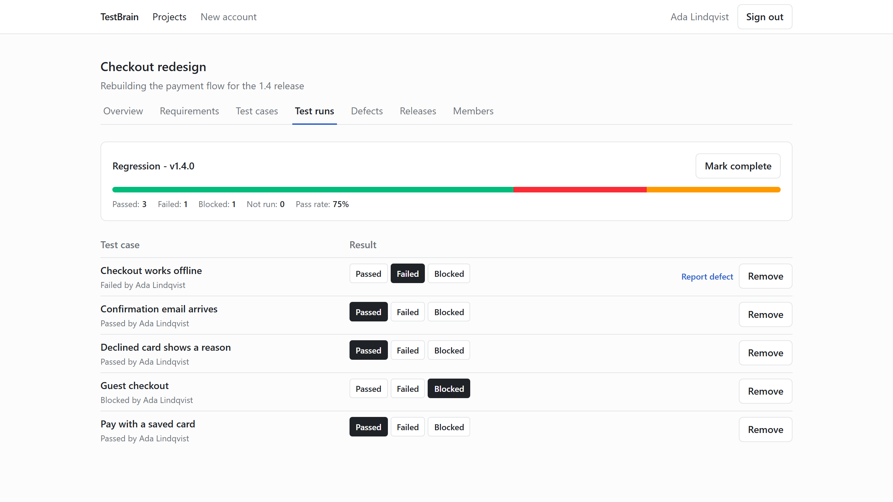
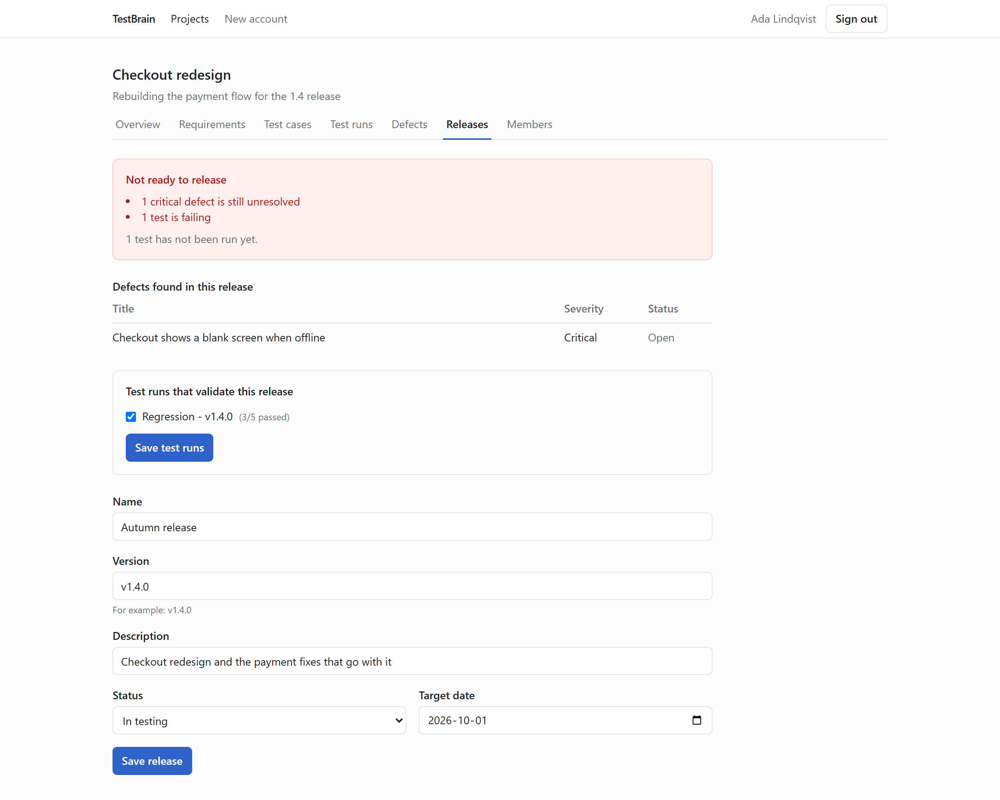
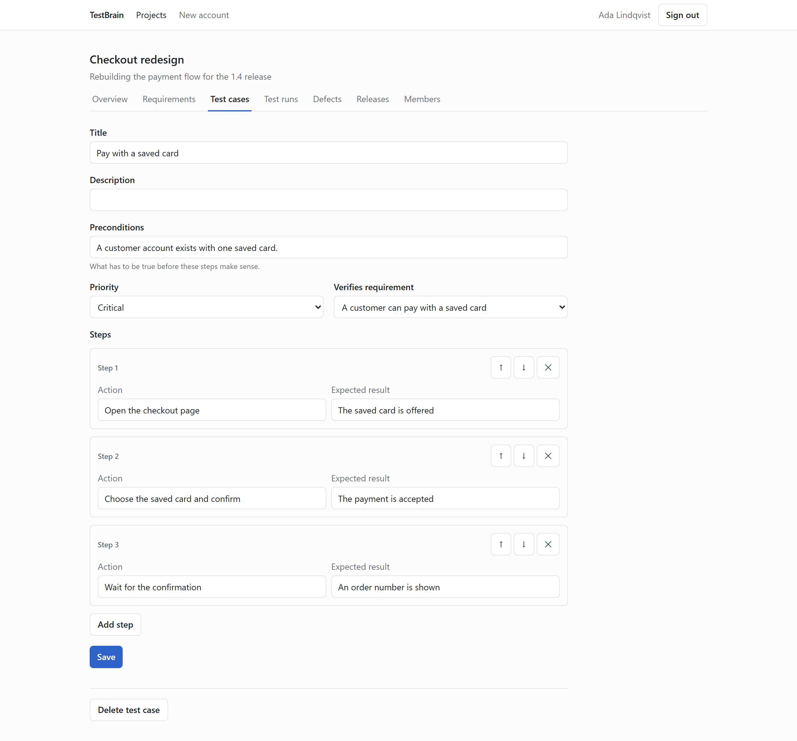
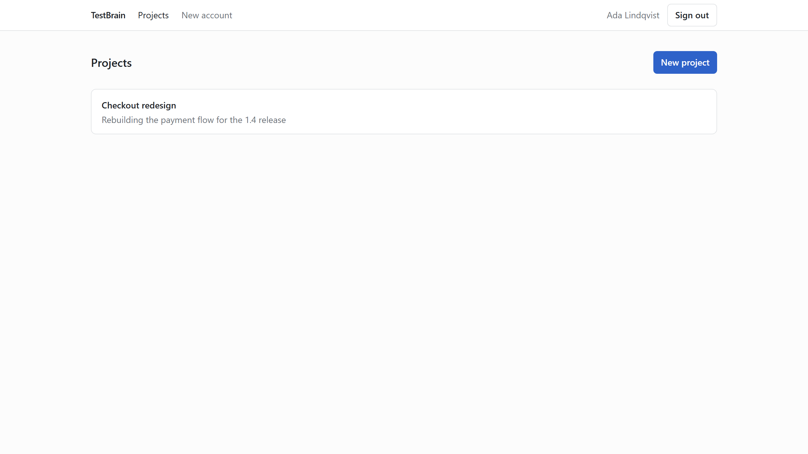
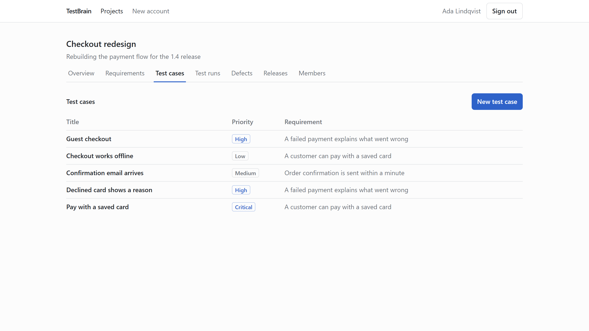

# TestBrain

Self-hosted QA and software testing platform for small development teams.

A small team can write down what the product should do, describe how to check it,
run those checks, record what broke, and decide whether a version is fit to ship.

## What is TestBrain?

TestBrain is a place for a small team to keep its requirements, test cases, test runs,
defects and releases in one system, and to see how they connect:

```
Requirement -> Test Case -> Test Run -> Defect -> Release
```

It runs entirely on your own machine or server. There are no AI features, no external
services, and no paid dependencies.

## Why I Built It

Most portfolio projects are a CRUD app with a login screen. I wanted one with real
rules in it: who may change what, what counts as an executed test, when a version
is allowed to ship. Those are the parts worth talking about, and the parts worth
testing.

The engineering constraint was as deliberate as the product: boring, explicit code
that a junior developer can read top to bottom. There is no clever abstraction in
here to be impressed by, which is the point.

## Features

**Projects and people.** Create a project, add members by email, give each one a
role. A role belongs to a membership, so somebody can be QA on one project and a
developer on another.

**Requirements.** What the product is supposed to do. Test cases link to them, which
is what makes the trail readable later.

**Test cases with ordered steps.** Each step is an action and an expected result,
kept as rows rather than buried in a blob of text. Steps are reordered by moving
them; the order on screen is the order that gets saved.

**Test runs.** One round of testing. Add test cases, then mark each one Passed,
Failed or Blocked. A summary updates as you go, and blocked tests are left out of
the pass rate — a run where one test passed and the rest are blocked is at 100% of
what could actually be checked.

**Automated results.** A test run can also be filled in from a JUnit XML report,
the format Playwright, Jest, pytest and most other runners write. Each test is
matched to a test case by its title, and a test case is created for any name that is new — so a project's
catalogue can be built from the report itself instead of typed in first. Results imported this way look exactly like results a
person recorded, so the summary and the release decision treat them the same.

**Defects.** A failed test carries a "Report defect" link that brings the test case
and the run along with it. Defects are closed rather than deleted, so the history
stays honest.

**Releases.** Point test runs at a version and it tells you whether it can ship,
with the reasons in plain words: _1 critical defect is still unresolved, 1 test is
failing_.

The whole trail:

```
Requirement → Test Case → Test Run → Defect → Release
```

## Screenshots

**A test run in progress.** Blocked tests are left out of the pass rate, so three
passed out of four actually executed reads as 75%, not 60%.



**A release that cannot ship yet**, and the two reasons why.



**A test case and its steps.** Each step is an action and an expected result, and
the order on screen is the order that gets saved.



<details>
<summary>More</summary>





</details>

These are generated rather than collected by hand, so they can be refreshed after a
change instead of quietly going stale:

```bash
npm run dev          # in one terminal
npm run screenshots  # in another
```

## Architecture

A modular monolith: one frontend, one backend, one PostgreSQL database.

```
Browser -> web (nginx, serves the React build and proxies /api)
             -> api (Fastify)
                  -> postgres
```

The browser only ever talks to one origin, so the session cookie is first-party and
there is no CORS configuration anywhere. The Vite dev server proxies `/api` the same
way nginx does in production.

Inside the API, each request flows through four layers with one responsibility each:

| Layer      | Responsibility                                         |
| ---------- | ------------------------------------------------------ |
| Route      | Declare the endpoint, attach auth, call the controller |
| Controller | Validate input, call the service, shape the response   |
| Service    | Business rules, permissions, workflows                 |
| Repository | Database queries, nothing else                         |

Pure business logic (`calculatePassRate`, `determineReleaseStatus`, ...) lives in
`*.logic.ts` files with no I/O, so it can be unit tested directly.

## Tech Stack

**Frontend** — React, TypeScript, Vite, Tailwind CSS, React Aria Components, React Router
**Backend** — Node.js, TypeScript, Fastify, Zod
**Database** — PostgreSQL, Prisma
**Testing** — Vitest, React Testing Library, Playwright
**Infrastructure** — Docker, Docker Compose, GitHub Actions

## Database

PostgreSQL, accessed through Prisma with the `@prisma/adapter-pg` driver adapter.

The schema grows phase by phase. Today it covers authentication:

| Model     | Purpose                                                               |
| --------- | --------------------------------------------------------------------- |
| `User`    | Login identity, Argon2id password hash, instance-admin flag           |
| `Session` | A signed-in session, owned by a user and deleted along with that user |

Sessions live in the database rather than inside a JWT, so logging out genuinely
revokes access. A session's primary key is the SHA-256 hash of the token held in the
user's cookie: a leaked database dump therefore contains no usable session tokens.

The generated Prisma Client is a build artefact. It is not committed; `prisma generate`
recreates it and runs automatically after `npm install`.

```bash
npm run db:migrate -w @testbrain/api -- --name describe_your_change
```

## Testing Strategy

- **Unit** (Vitest) — pure business logic and permission functions. Fast, no database.
- **Integration** (Vitest) — the real Fastify app driven through `app.inject()` against a
  real PostgreSQL database. Prisma is not mocked: the point is to verify constraints and
  authorization, and a mock would only prove that a mock was called.
- **Component** (React Testing Library) — components with real interaction logic.
- **End to end** (Playwright) — a small number of whole-product flows.

Integration tests run against their own database (`testbrain_test`), created and
migrated automatically the first time the suite runs. They never touch development
data, and the suite refuses to start if it is pointed at the development database.
PostgreSQL must be running:

```bash
npm run db:up
```

```bash
npm test          # unit, integration and component tests
npm run test:e2e  # the browser tests
```

There is more in [docs/testing.md](docs/testing.md), including the security tests
that were checked by deliberately breaking the code to confirm they went red.

## Self Hosting

TestBrain runs entirely on your own machine. No Supabase, no Firebase, no Auth0,
nothing to sign up for.

```bash
git clone https://github.com/obeyhades/TestBrain.git
cd TestBrain
cp .env.example .env
```

Fill in `POSTGRES_PASSWORD` and `SESSION_SECRET`, then:

```bash
docker compose up -d
```

Open **http://localhost:3000**. The first visitor is asked to create the account
that owns the instance; registration closes after that, and the owner creates
accounts for everybody else.

Migrations run when the API container starts, so there is nothing else to remember.

| Variable            | What it is                                                    |
| ------------------- | ------------------------------------------------------------- |
| `POSTGRES_PASSWORD` | Database password, used by both containers                    |
| `SESSION_SECRET`    | Signs session cookies. At least 32 characters                 |
| `APP_URL`           | The address people use. Decides whether cookies require HTTPS |
| `APP_PORT`          | Host port for the web container. Defaults to 3000             |

## Docker

Three containers, no orchestration platform:

| Container  | What it does                                  | Published |
| ---------- | --------------------------------------------- | --------- |
| `web`      | nginx: serves the React build, proxies `/api` | port 3000 |
| `api`      | Fastify, runs migrations on start             | no        |
| `postgres` | The database, on a named volume               | no        |

Only the web container is reachable from outside. The browser talks to one origin,
which is why the session cookie is first-party and there is no CORS configuration
in the project.

Development uses a single PostgreSQL container instead, with the apps running on
the host so reloads stay fast:

```bash
npm run db:up      # just the database
npm run db:down    # stop it
```

## Development

Requires Node.js 20 or newer and Docker.

```bash
npm install
cp .env.example .env
```

Then start everything -- database, API and web app -- with one command:

```bash
npm run dev
```

The app is then at **http://localhost:3000**. The first visitor is asked to create
the account that owns the instance.

> **Adding a dependency?** Regenerate the lockfile with a clean install:
> `rm -rf node_modules package-lock.json && npm install`. npm can silently drop
> platform-specific optional dependencies during an incremental install, producing a
> lockfile that `npm ci` cannot install from.

Checks, all of which also run in CI:

```bash
npm run format:check && npm run lint && npm run typecheck && npm test && npm run build
```

## Engineering Principles

This project intentionally favours simple, predictable code over clever abstraction.

- **KISS** — the straightforward version wins unless a real problem demands otherwise.
- **Single Responsibility** — one function, one job; one file, one obvious purpose.
- **Separation of Concerns** — UI does not query the database; repositories do not
  contain business rules; services do not know about HTTP status codes.
- **Low Coupling** — business logic is plain TypeScript, usable from the API, from tests,
  and from a future script without rewriting it.
- **High Cohesion** — code is organised by feature, so everything about test runs lives
  together.
- **YAGNI** — features and abstractions are added when they are needed, not before.

Duplication is sometimes preferable to a bad abstraction. Where this codebase repeats
itself on purpose, the repetition is the point: it keeps each call site readable on its
own.

## Out of Scope

Deliberately not built: integrations (GitHub, Jira, Slack), email notifications,
real-time updates, configurable workflows, custom roles, a public API, file uploads
and advanced analytics. Some of those are the most interesting features a QA tool
can have. Building them before the core worked would have been the wrong order.

## Future Improvements

- Snapshot test case content into a test run, so editing a case later does not
  rewrite the history of past runs. This is the most significant known limitation.
- Many-to-many links between requirements and test cases.
- Attach screenshots and logs to defects.
- Human-readable keys per project (`TC-12`, `BUG-4`).
- A smaller API image: it currently ships its build dependencies so that migrations
  can run at startup with the same toolchain.

## License

MIT
